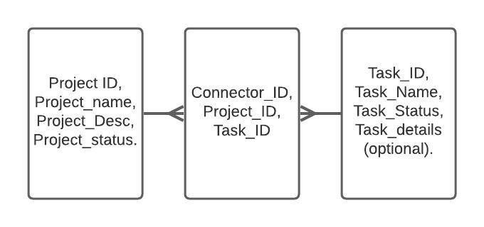

# CRUD-Project-3D-Print

This is the GIT repository for my QA Training Academy project due on the 24th of May.

My Idea is a CRUD application for keeping track of 3D prints for my personal printer. Effectively, it has to be able to start a print project ( create), do test runs with the material (create), at different temperatures and retraction settings depending upon outcome ( update), maybe hold some comments on prior temperatures (create/update), so i can monitor the progress of the task (read) and finally close down the tests and print project when complete ( delete).

- Table1: ERD for the SQL databases used in the project

The ERD Table shown above shows a many to many relationship for the overall project ( i.e. Printing a rubber duck) to the the Tasks ( i.e. calibrating the print bed, baking the PLA, test calibration prints) because things like calibration and preparing of the filament can be done for one project and aslong as the test prints come back fine don't need to be repeated for the next project(s). 
There are a lot of tasks in 3D printing that when broken down for a individual print eliminate work done for several projects, as well as the fact that several projects can be printed at once provided there is room on the print bed, to reduce user input time when setting up prints.
With respect to Project_status and Task_status, these have the options of ongoing or complete as options as there's little point in having string input for something that can be one or the other.
Task_details is optional because naming a task " clean the nozzle" is self evident, but when running say a extruder temperature test on the PLA filament, its useful to add details like temperature range currently considered, because you will often start off low, then high, and split the difference around the manufacturers quoted temp ranges due to things like moisture and room temperature affecting the behaviour of the material.

## Design

In terms of design, I want the index page to Welcome people to the site, explain to them how the site works / maybe show some examples, with some buttons to send people to a list of current projects with their active tasks, to the list of Tasks in more detail, and directly to the add project page.
The add project page should send them to the current projects page, where they can either add new tasks and assign them to that project, or ammend existing tasks to also be assigned to the new project where applicable.

So in terms of design, there are 8 html pages:
- Index
- Add Project
- View Current Projects
- Update Current Tasks
- Add Task
- View Current Tasks
- Update Current Tasks
- layout

Overall, the plan is for the website to follow this Flow:

So the decision markers denote when a page has multiple options for you to follow instead of just a submit field, overall I feel this is best as you're able to navigate
easily between the Projects and their associated Tasks List, and the Tasks with their assigned Projects list. This means that in terms of the python code, there needs to be app
route for many of the decisions, so in the case of deleting a task or project, there needs to be an app route which takes in a project / task ID, deletes, and redirects back to
the route you came from to observe the updated list. Same goes for an update or add app route infact, as although these routes should open their own html, they would redirect 
back to a list after the addition of their task or project or updated info for either. 
I plan to add the set complete option / finished or unfinished as a button on the table next to the task / Project, so these do not need their own HTML / should redirect back
to current tasks or projects. 

Whilst I could add code to prevent duplicate tasks from being entered, within 3D printing this isn't so clear cut, as i could be printing the exact same model in different PLA
materials, in which case it could make sense for the user to add identical project ( or Model) names but differ the description or even associated tasks.
In the case of tasks, whilst it is true levelling the print bed works for multiple projects, this is only assuming they use the same filament and can be printed simultaneously,
best practice for 3D printing necessitates that you re level the print bed after every print for optimal results as removing from the print bed can de-level it.
Hence why duplicated entries are permitted in my project. 

The code, HTML templates, and Testing code should be kept in seperate folders.

## Code Documentation

Jenkins was intended to be implemented however I was having issues getting it to work through Docker so wasn't available for use in the demonstration Monday, as i was also
cautious about overusing my GCP allowance. The basic plan for implementing Jenkins however is to add it to the sudoers list so you can install pip and get the required packages 
needed to run the code on there, and run the app through Jenkins. 

Similar Reasoning as to why I Used SQLite rather than GCP for this project. 

To keep track of the code as I developed the project I used Jira's Kanban Boards, with User stories for the CRUD functionality ( As a user i should be able to add new tasks 
to update my list etc), and then associating tasks for items that needed to be implemented for that functionality, like HTML pages for the relevant app routes in the case
of read functionality, below you can see an example of the Jira boards used. 

An example of the Kanban Boards used to plan this project.

Kanban board post sprint

## Use Examples

So the first page you'll see when opening the app is the about page:

Upon clicking the view current projects you will be redirected to: 

Now lets add a new project by clicking the add project button!

After submitting, we're redirected to our now updated Project page:

Now to give this project a task, by clicking on the add task button in it's row: 

We see that again the page is updated:

Now by going to the current tasks lists, we can attach an existing task to our new project!

Moving back to current projects we can see that our project now shares the same task as the other 2. 

There! We now have our new Project and it's exclusive and non-exclusive sub tasks required for completion!

## Risk Assessments

And following up from this to the final risk assessment. 

Following the Below risk assessment Matrix, I would put the overall risk value of the risks shown in order from top row to bottom of: Med high , Med high, low med , and medium
I feel this fits well, as the first two are easily remedied but also quite damaging if they go un-addressed , whilst personal machine failure is less of an issue in the modern
day with remote version control like github and most people having multiple devices you can code from ( like how android phones can run python etc), and finally Deadline not
being met is true medium as whilst it is a big risk, it's managable with proper time management, but definitely more risky than machine failure and less so than the first two.

Analysis of Risk Assessment:
Overall I believe the first risk's management approach to be very effective, I followed the standard agile methodology as you can see from this repos network,
where i made new branches for test features, implemented into DEV to confirm they definitely worked before finally implementing them to main, and this has prevented any bugs
from reaching the main build! Further info had to be added to the sensitive data entry, as I took further action in warning users about not posting their secret keys to ensure
that multiple users don't fork their own versions from this repo and end up sharing the same key. By removing a default key, it also means people read through the readme ( which
they should anyway) and get educated on how to best utilise my code / set their version up safely. Frequent pushes were adhered to in the event of machine failure. 
In regards to the last entry, I should have also advised to people to add further, more detailed comments, to merges as If behind on documentation they can be used to speed up
filling the documenation out and enable more features to be implemented. It was beneficial however, as whilst i failed to get Jenkins and subsequently Integration testing
working, I did produce fully functional code. 

## Setup

It's first necessary to install all the necessary dependencies and languages needed to run the script, to do so is as simple as pip install ( package ).
To get Pip, use sudo apt install python3 python3-pip.
From there the rest should be installable using Pip in your terminal. 

Then you want to make a new folder ( call it whatever) and clone this repository into your local machine ( follow Git's own guide on installing GIT) seeing as this guide
is hosted on github ^^ )

Once cloned, go into the code directory and open app.py, in order to get this to run replace the site address circled in green with the address of your SQL database, 
and enter a secret key into red. For security purposes, it is very important that you do not leave your secret key when pushing to your own repo etc in your app file, 
this is sensitive data. 

After that setup is run, enter into your terminal:

python create.py
python app.py

And you'll be good to start using my app to keep track of your own print projects! Hurray!

### PyTest Unit Testing

As shown above a overall coverage of 91% testing was achieved. 
Due to the nature of my application it was relatively straight forward to check that all of the App routes functioned as intended. By using a test base that only
added 1 task and 1 project , and a copy with the completion markers set to true ( default to false when unspecified in the first case), I was able to simply check
that once the app was, the new unique keyword was found on the page in case of add_project, add_task, that the update_task and Update_project did not contain the old
entry name + did contain the new entry name , that the project / task was no longer found under current_ X when deleted ETC. I think that likely the reason i failed to get
full test coverage is that perhaps for the code not contained within functions? Though I currently lack the expertise to be sure , as I tested for response codes for the
html sites too when applicable atleast once, so it's sadly a mystery for me at the moment. It could be a case of having to Implement a check that passing the wrong ID in for
a task / project that doesn't exist gives a error code? Though at the time of writing this I wouldnt be able to implement and test in time to ammend the document. 

In the case of adding Projects, I also asserted that the response data contain the description added etc, to make sure the add_project form had full functionality.

## Dependencies/ Languages
- Python3
- Flask
- flask_sqlalchemy
- flask_wtf
- flaskform
- html
- sql
- googlecloud or AWS sql for database hosting ( alternatively host locally with sqlite)

